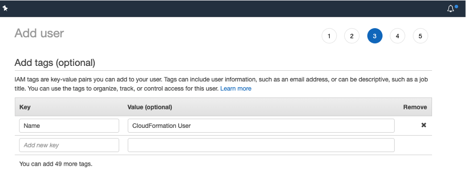
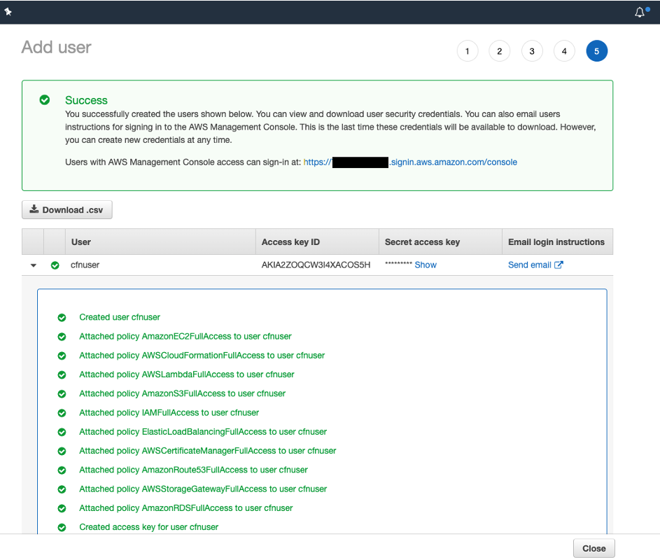

// Add steps as necessary for accessing the software, post-configuration, and testing. Don’t include full usage instructions for your software, but add links to your product documentation for that information.
//Should any sections not be applicable, remove them

== Test the deployment
// If steps are required to test the deployment, add them here. If not, remove the heading
If you provided an Orchestrator URL, log in to Orchestrator, and ensure that the Robot is present and connected to the tenant.
:xrefstyle: short
[#test1]
.Test the deployment
image::../images/test1.png[test1,width=100%,height=100%]

[NOTE]
====
The deployment creates a *MODERN* folder called *AWSDeployed*, which contains the UiPath Robot.

Depending on the type of Robot you selected, you will encounter the following situations:

* For Unattended Robot, the *STATUS* is *N/A*, but you will be able to run jobs on the machine. This happens because the new local administrator account created by the deployment is not logged in to the machine. 
* For Attended Robot, the *STATUS* is *DISCONNECTED* because the built-in administrator account is not logged into the machine.
====

Access the Robot VM from the bastion host to check that the Robot was deployed successfully. 
[NOTE]
==== 
For Attended Robot, connect to it through the administrator account. To retrieve the password for the AWS portal, use your private key, mentioned in the deployment.

For Unattended Robot, retrieve the user account from the Robots page in Orchestrator. The user format is `domain/username` or `machinename/username`. Use the same password that you set in the configuration step.
====

The result should like like <<test2>>

:xrefstyle: short
[#test2]
.Test the deployment
image::../images/test2.png[test2,width=100%,height=100%]

// == Post-deployment steps
// If post-deployment steps are required, add them here. If not, remove the heading

== Create a key pair

Amazon EC2 uses public-key cryptography to encrypt and decrypt login information. In Windows instances, the key pair obtains the administrator password via the Amazon EC2 console and then logs in using Remote Desktop Protocol (RDP). On Linux, the key pair authenticates the SSH (Secure Shell) login. For more information, see https://docs.aws.amazon.com/AWSEC2/latest/UserGuide/ec2-key-pairs.html[Amazon EC2 key pairs and Linux instances^].

To create a key pair in your preferred Region, do the following:

[start=1]
. In your AWS Management Console, choose an AWS Region.
. On the *Services* menu, choose *EC2*.
. Under *Network and Security*, choose *Key Pairs*.
. Choose *Create Key Pair*.
. Enter a name and choose *Create*.

:xrefstyle: short
[#ds1]
.Create a key pair
image::../images/ds1.png[ds1,width=100%,height=100%]

== Create IAM user

To launch the Cloudformation stack for this Quick Start, you’ll need an IAM user with programmatic access to following AWS services:

* AWS CloudFormation
* AWS IAM, Amazon EC2
* Amazon S3
* AWS Lambda
* AWS Storage Gateway.

NOTE: If you do already have an IAM user with full access to these services, or have administrator access, you can skip this section.

[start=1]
:xrefstyle: short
. If you do not already have such an IAM user, https://docs.aws.amazon.com/IAM/latest/UserGuide/id_users_create.html#id_users_create_console[create one^] from AWS console. In <<cfnuser>>, a user is created with programmatic and console access.

[#cfnuser]
.Adding an IAM user
image::../images/cfnuser.png[IAM,width=100%,height=100%]

[start=2]
. To follow AWS best practices, allow access to required services. When setting permissions for the user, choose *Attach existing policies directly*. Then choose roles with full access for each of the services listed previously.

:xrefstyle: short
[#iam_2]
.Setting permissions
image::../images/iam_2.png[IAM,width=100%,height=100%]

TIP: As shown in <<iam_2>>, you can filter the list using the search box.

[start=3]
. Choose *Next: Tags* and optionally add a Name tag to identify the user.  
+
:xrefstyle: short
[#iam_3]
.Adding optional tags

[start=4]
. Choose *Next: Review* and verify that the user is configured with full access to the services listed previously.  
+
:xrefstyle: short
[#iam_4]
.Reviewing user details
image::../images/iam_4.png[IAM,width=100%,height=100%]

[start=5]
. Choose *Create User*.
. Choose *Download .csv* to download and store the user's security credentials in CSV format for future reference.

:xrefstyle: short
[#iam_5]
.IAM user created

== Best practices for using {partner-product-short-name} on AWS
// Provide post-deployment best practices for using the technology on AWS, including considerations such as migrating data, backups, ensuring high performance, high availability, etc. Link to software documentation for detailed information.

=== High availability and disaster recovery
Amazon EC2 provides the ability to place instances in multiple locations composed of AWS Regions and Availability Zones. Regions are dispersed and located in separate geographic areas. Availability Zones are distinct locations within a Region that are engineered to be isolated from failures in other Availability Zones. They provide inexpensive, low-latency network connectivity to other Availability Zones in the same Region.

By launching your instances in separate Regions, you can design your application to be physically closer to specific customers or to meet legal or other requirements. By launching your instances in separate Availability Zones, you can protect your applications from the failure of a single location. Microsoft Exchange provides infrastructure features that complement the high availability and disaster recovery scenarios supported in the AWS Cloud.

The Quick Start also provides the option to deploy into a minimum of two Availability Zones. This option mitigates the loss of quorum in the case of a failure of a single node. However, you can choose this option only in AWS Regions that include two or more Availability Zones. For a current list of Availability Zones, see https://aws.amazon.com/about-aws/global-infrastructure/[AWS Global Infrastructure^].

To customize UiPath software for your business, IT, and security requirements, consult the https://docs.uipath.com/[UiPath Documentation Portal^].

== Security
// Provide post-deployment best practices for using the technology on AWS, including considerations such as migrating data, backups, ensuring high performance, high availability, etc. Link to software documentation for detailed information.

=== Security groups and firewalls
When Amazon EC2 instances are launched, they must be associated with a security group, which acts as a stateful firewall. You have complete control over the network traffic entering or leaving the security group. You can build granular rules that are scoped by protocol, port number, and source, destination IP address, or subnet. By default, all outbound traffic from security group is permitted. Inbound traffic, however, must be configured to allow the appropriate traffic to reach your instances.

We recommend that you tightly control inbound traffic. Doing this reduces the attack surface of your EC2 instances yet leaves the following ports open for application communication.

*UiPath Robot TCP ports*

:xrefstyle: short
[#security1]
.TCP ports
image::../images/security1.png[security1,width=50%,height=50%]

* 3389 for RDP access
* 443 for communication with UiPath Orchestrator

This Quick Start configures the following security groups for the UiPath stack:

[cols="25,25,25,25",grid="rows",frame="topbot", options="header"]
|===
|Security group
|Associated with
|Inbound source
|Ports

|StackName-SecurityStack-RobotSecurityGroup
|Robots
|0.0.0.0/0
|Inbound: 443, 3389 +
Outbound: any ports
|===

For more information, see https://docs.uipath.com/orchestrator/docs/security-best-practices[Security Best Practices^]. 

//Provide any other information of interest to users, especially focusing on areas where AWS or cloud usage differs from on-premises usage.

=== Security of the AWS infrastructure
AWS provides a set of building blocks, such as Amazon EC2 and Amazon VPC, that you can use to provision your application's infrastructure. AWS operates under a shared security responsibility model, where AWS is responsible for the security of the underlying cloud infrastructure and you are responsible for securing workloads you deploy in AWS. For more information, see https://docs.aws.amazon.com/whitepapers/latest/introduction-aws-security/introduction-aws-security.pdf[Introduction to AWS Security^]. 

== Resources

* https://aws.amazon.com/cloudformation/[AWS CloudFormation^]
* https://aws.amazon.com/vpc/[Amazon VPC^]
* https://aws.amazon.com/ec2/[Amazon EC2^]
* https://aws.amazon.com/iam/[AWS IAM^]
* https://aws.amazon.com/s3/[Amazon S3^]
* https://aws.amazon.com/storagegateway/[AWS Storage Gateway^]
* https://aws.amazon.com/lambda/[AWS Lambda^]